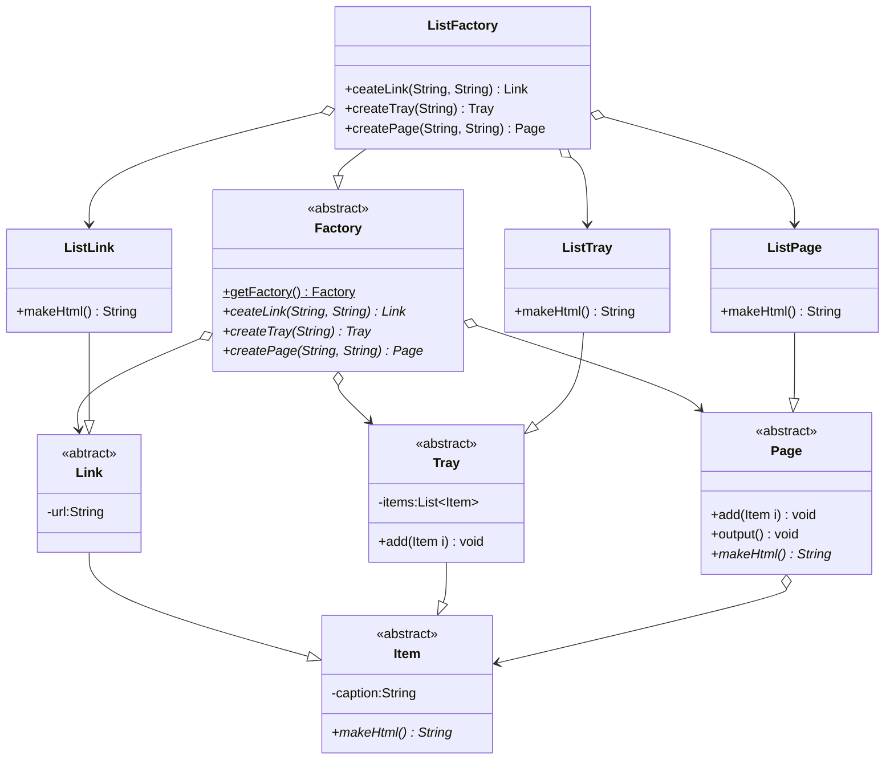

```mermaid
classDiagram

class Factory{
	<<abstract>>
	+getFactory()$Factory
	+ceateLink(String, String)*Link
	+createTray(String)*Tray
	+createPage(String, String)*Page
}

class Item{
	<<abstract>>
	-caption:String
	+makeHtml()*String
}

class Link{
	<<abtract>>
	-url:String
}

class Tray{
	<<abstract>>
	-items:List~Item~
	+add(Item i)void
}

class Page{
	<<abstract>>
	+add(Item i)void
	+output()void
	+makeHtml()*String
}

Link --|> Item
Tray --|> Item
Page o--> Item

Factory o--> Link
Factory o--> Tray
Factory o--> Page

class ListFactory{
	+ceateLink(String, String)Link
	+createTray(String)Tray
	+createPage(String, String)Page
}

ListFactory --|> Factory

class ListLink{
	+makeHtml()String
}

ListLink --|> Link

class ListTray{
	+makeHtml()String
}

ListTray --|> Tray


class ListPage{
	+makeHtml()String
}

ListPage --|> Page

ListFactory o--> ListLink

ListFactory o--> ListTray

ListFactory o--> ListPage
```

