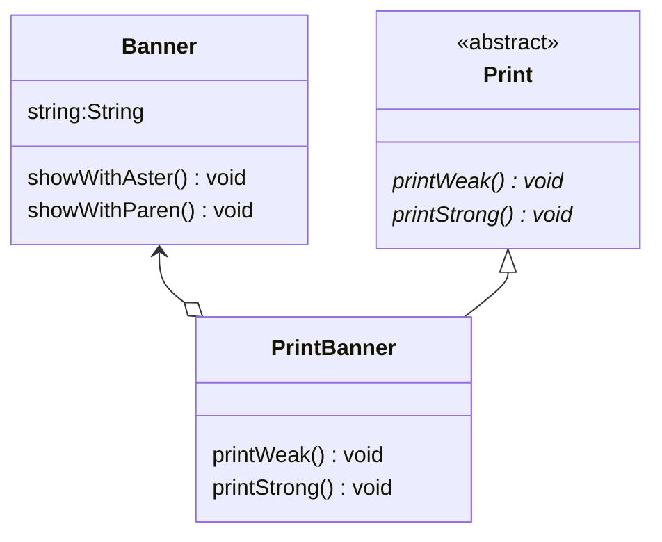

```mermaid
classDiagram

class Banner{
   string:String
   showWithAster()void
   showWithParen()void
}

class Print{
   <<abstract>>
   printWeak()*void
   printStrong()*void
}

class PrintBanner{
   printWeak()void
   printStrong()void
}

Banner <--o PrintBanner
Print <|-- PrintBanner
```

