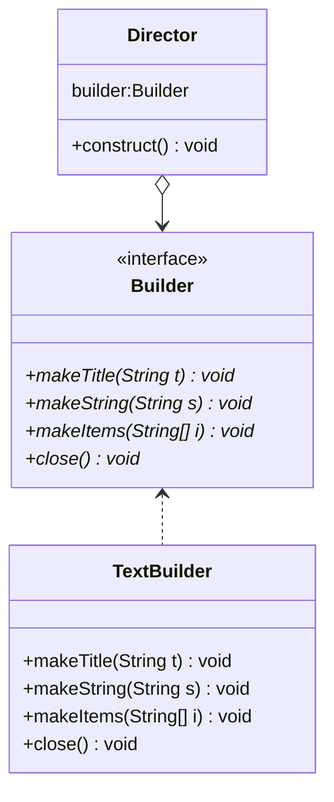

```mermaid
classDiagram

class Builder{
	<<interface>>
	+makeTitle(String t)*void
	+makeString(String s)*void
	+makeItems(String[] i)*void
	+close()*void
}

class Director{
	builder:Builder
	+construct()void
}

Director o--> Builder

class TextBuilder{
	+makeTitle(String t)void
	+makeString(String s)void
	+makeItems(String[] i)void
	+close()void
}

Builder <.. TextBuilder
```

