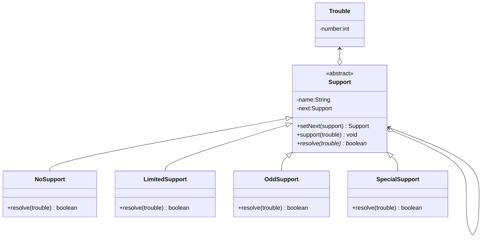

```mermaid
classDiagram

class Trouble{
	-number:int
}

class Support{
	<<abstract>>
	-name:String
	-next:Support
	+setNext(support)Support
	+support(trouble)void
	+resolve(trouble)*boolean
}

class NoSupport{
	+resolve(trouble)boolean
}

class LimitedSupport{
	+resolve(trouble)boolean
}

class OddSupport{
	+resolve(trouble)boolean
}

class SpecialSupport{
	+resolve(trouble)boolean
}

Support <|-- NoSupport
Support <|-- LimitedSupport
Support <|-- OddSupport
Support <|-- SpecialSupport
Support o--> Support
Trouble <--o Support
```

