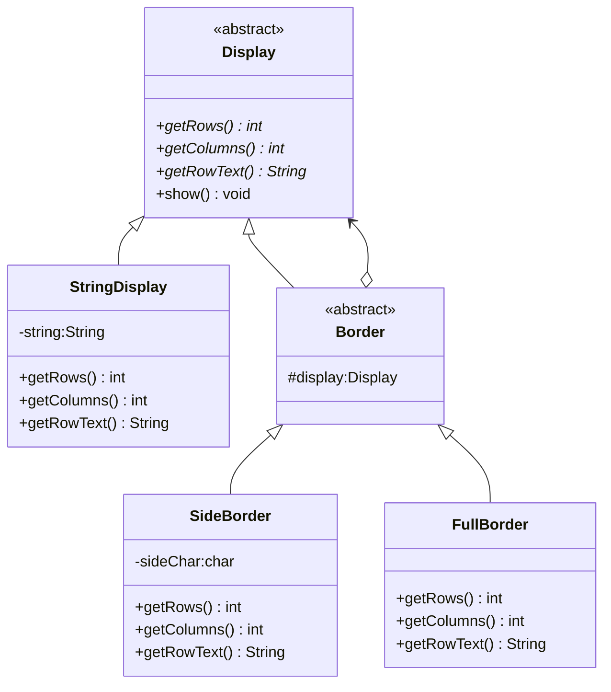

```mermaid
classDiagram

class Display{
	<<abstract>>
	+getRows()*int
	+getColumns()*int
	+getRowText()*String
	+show()void
}

class StringDisplay{
	-string:String
	+getRows()int
	+getColumns()int
	+getRowText()String
}

class Border{
	<<abstract>>
	#display:Display
}

class SideBorder{
	-sideChar:char
	+getRows()int
	+getColumns()int
	+getRowText()String
}

class FullBorder{
	+getRows()int
	+getColumns()int
	+getRowText()String
}

Display <|-- StringDisplay
Display <|-- Border
Border <|-- SideBorder
Border <|-- FullBorder
Border o--> Display
```

