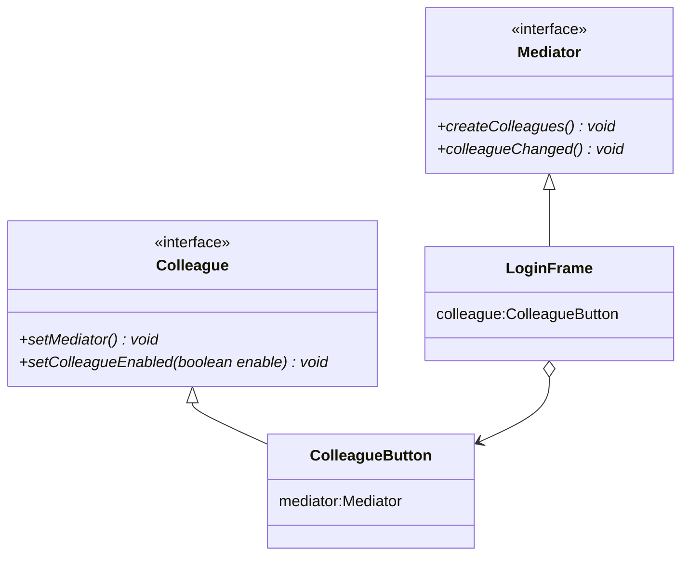

```mermaid
classDiagram

class Colleague{
	<<interface>>
	+setMediator()*void
	+setColleagueEnabled(boolean enable)*void
}

class Mediator{
	<<interface>>
	+createColleagues()*void
	+colleagueChanged()*void
}

class ColleagueButton{
	mediator:Mediator
}

class LoginFrame{
	colleague:ColleagueButton
}

Colleague <|-- ColleagueButton
Mediator <|-- LoginFrame
LoginFrame o--> ColleagueButton
```

