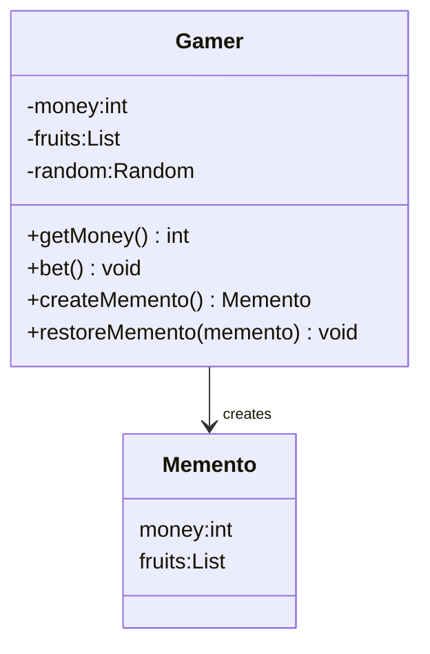

```mermaid
classDiagram

class Gamer{
	-money:int
	-fruits:List
	-random:Random
	+getMoney()int
	+bet()void
	+createMemento()Memento
	+restoreMemento(memento)void
}

class Memento{
	money:int
	fruits:List
}

Gamer -->"creates" Memento
```

