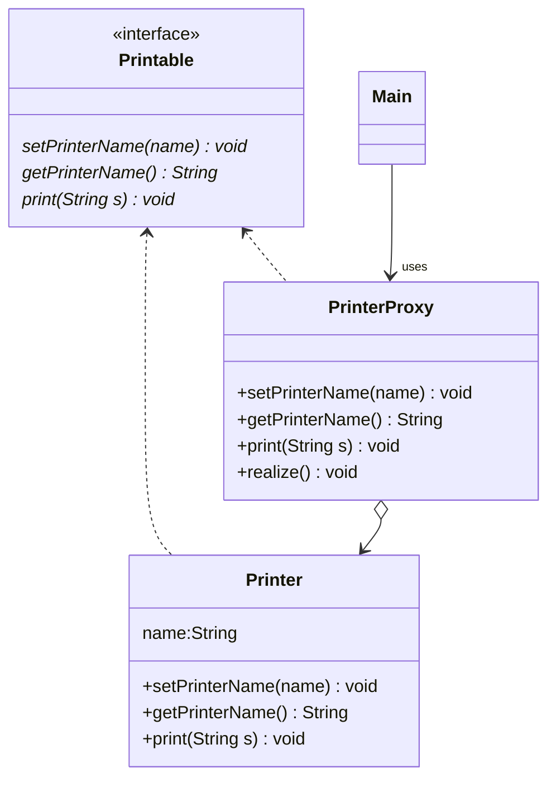

```mermaid
classDiagram

class Printable{
	<<interface>>
	setPrinterName(name)*void
	getPrinterName()*String
	print(String s)*void
}

class Printer{
	name:String
	+setPrinterName(name)void
	+getPrinterName()String
	+print(String s)void
}

class PrinterProxy{
	+setPrinterName(name)void
	+getPrinterName()String
	+print(String s)void
	+realize()void
}

Main -->"uses" PrinterProxy
Printable <.. Printer
Printable <.. PrinterProxy
PrinterProxy o--> Printer
```

