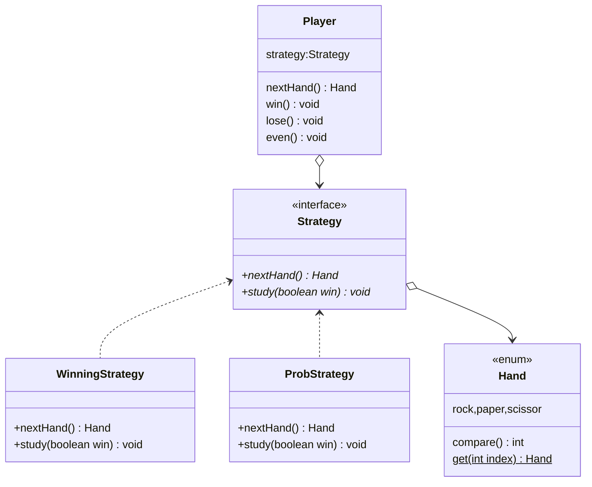

```mermaid
classDiagram

class Strategy{
	<<interface>>
	+nextHand()*Hand
	+study(boolean win)*void
}

class WinningStrategy{
	+nextHand()Hand
	+study(boolean win)void
}

class ProbStrategy{
	+nextHand()Hand
	+study(boolean win)void
}

Strategy <.. WinningStrategy
Strategy <.. ProbStrategy

class Hand{
	<<enum>>
	rock,paper,scissor
	compare()int
	get(int index)$Hand
}

Strategy o--> Hand

class Player{
	strategy:Strategy
	nextHand()Hand
	win()void
	lose()void
	even()void
}

Player o--> Strategy
```

