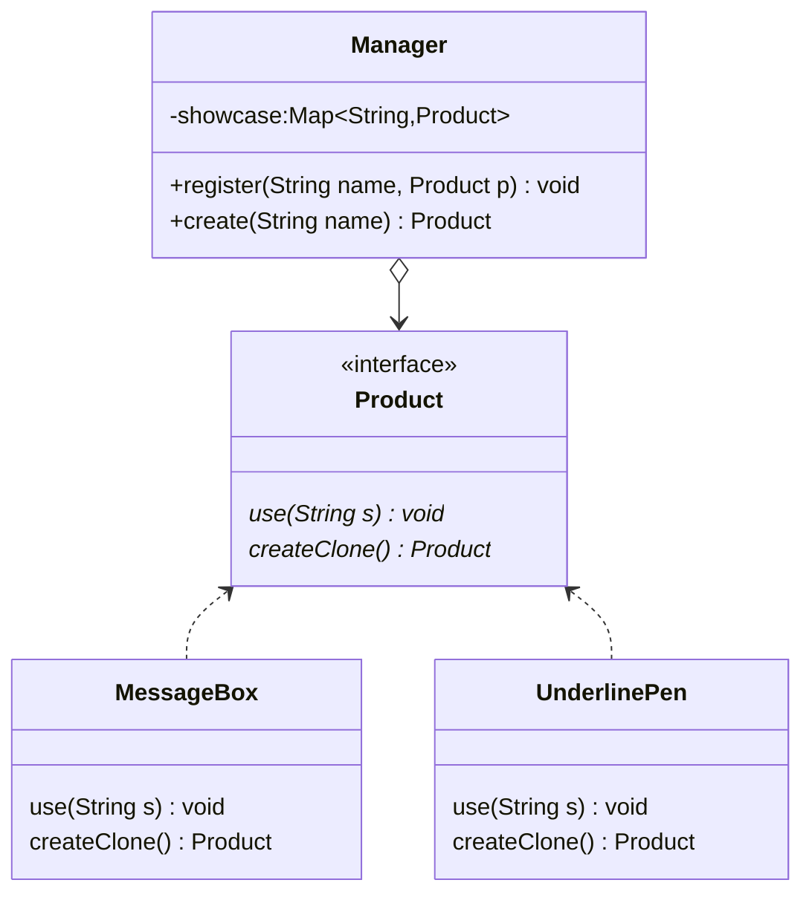

```mermaid
classDiagram

class Manager{
	-showcase:Map~String,Product~
	+register(String name, Product p)void
	+create(String name)Product
}

class Product{
	<<interface>>
	use(String s)*void
	createClone()*Product
}

class MessageBox{
	use(String s)void
	createClone()Product
}

class UnderlinePen{
	use(String s)void
	createClone()Product
}

Manager o--> Product
Product <.. MessageBox
Product <.. UnderlinePen
```

