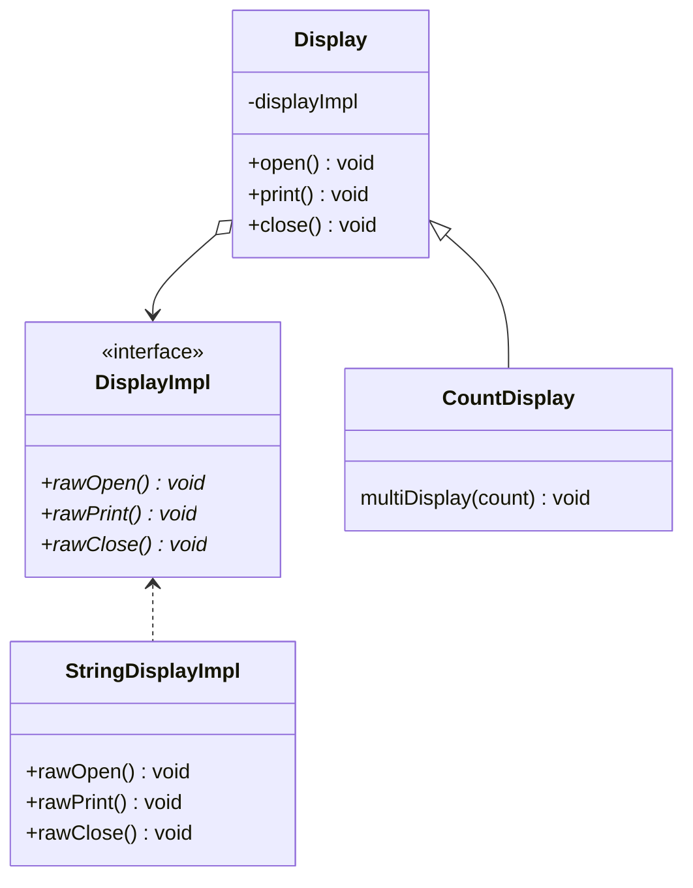

```mermaid
classDiagram

class DisplayImpl{
	<<interface>>
	+rawOpen()*void
	+rawPrint()*void
	+rawClose()*void
}

class Display{
	-displayImpl
	+open()void
	+print()void
	+close()void
}

Display o--> DisplayImpl

class CountDisplay{
	multiDisplay(count)void
}

Display <|-- CountDisplay

class StringDisplayImpl{
	+rawOpen()void
	+rawPrint()void
	+rawClose()void
}

DisplayImpl <.. StringDisplayImpl
```

