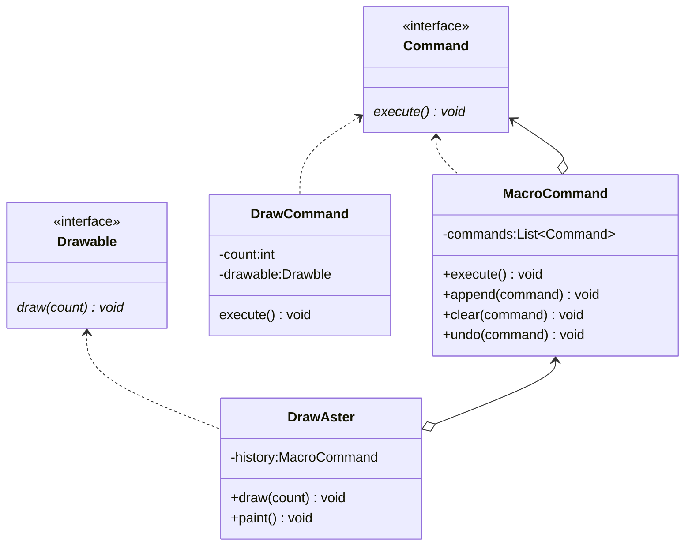

```mermaid
classDiagram

class Command{
	<<interface>>
	execute()*void
}

class MacroCommand{
	-commands:List~Command~
	+execute()void
	+append(command)void
	+clear(command)void
	+undo(command)void
}

Command <.. MacroCommand
MacroCommand o--> Command

class DrawCommand{
	-count:int
	-drawable:Drawble
	execute()void
}

Command <.. DrawCommand

class Drawable{
	<<interface>>
	draw(count)*void
}

class DrawAster{
	-history:MacroCommand
	+draw(count)void
	+paint()void
}

Drawable <.. DrawAster
MacroCommand <--o DrawAster
```

