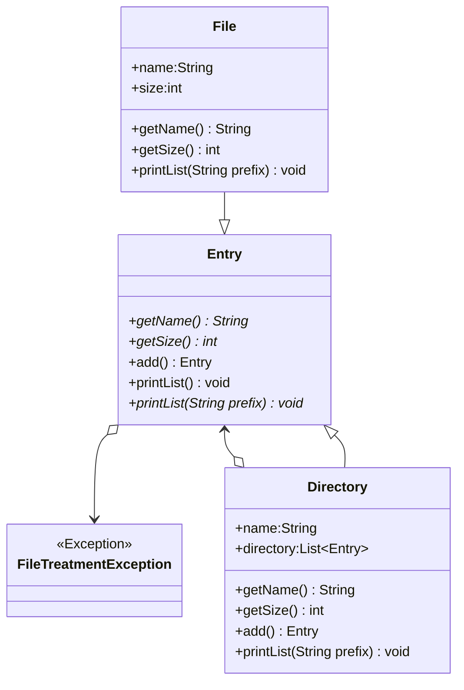

```mermaid
classDiagram

class Entry{
	+getName()*String
	+getSize()*int
	+add()Entry
	+printList()void
	+printList(String prefix)*void
}

class FileTreatmentException{
	<<Exception>>
}

Entry o--> FileTreatmentException

class File{
	+name:String
	+size:int
	+getName()String
	+getSize()int
	+printList(String prefix)void
}

class Directory{
	+name:String
	+directory:List~Entry~
	+getName()String
	+getSize()int
	+add()Entry
	+printList(String prefix)void
}

File --|> Entry
Directory --|> Entry
Entry <--o Directory
```

