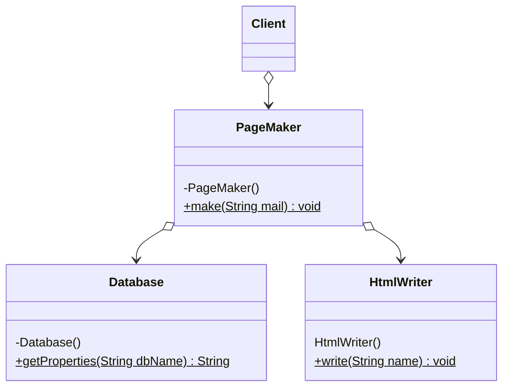

```mermaid
classDiagram

class Database{
	-Database()
	+getProperties(String dbName)$String
}

class HtmlWriter{
	HtmlWriter()
	+write(String name)$void
}

class PageMaker{
	-PageMaker()
	+make(String mail)$void
}

PageMaker o--> Database
PageMaker o--> HtmlWriter

Client o--> PageMaker
```

