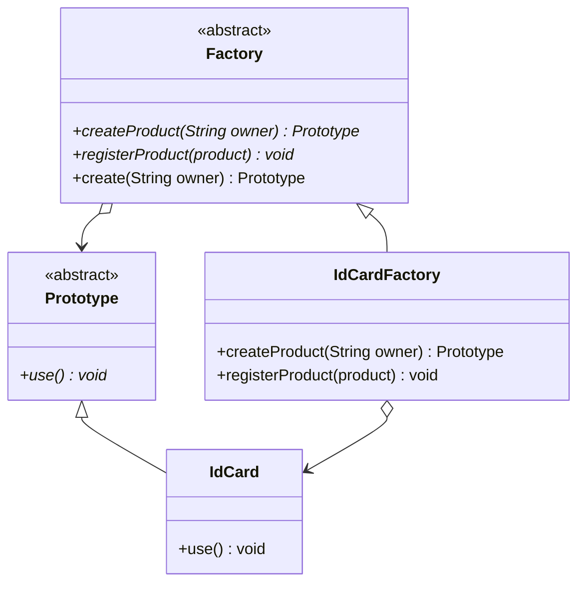

```mermaid
classDiagram

class Factory{
	<<abstract>>
	+createProduct(String owner)*Prototype
	+registerProduct(product)*void
	+create(String owner)Prototype
}

class Prototype{
	<<abstract>>
	+use()*void
}

class IdCardFactory{
	+createProduct(String owner)Prototype
	+registerProduct(product)void
}

class IdCard{
	+use()void
}

Factory <|-- IdCardFactory
Factory o--> Prototype
Prototype <|-- IdCard
IdCardFactory o--> IdCard
```

