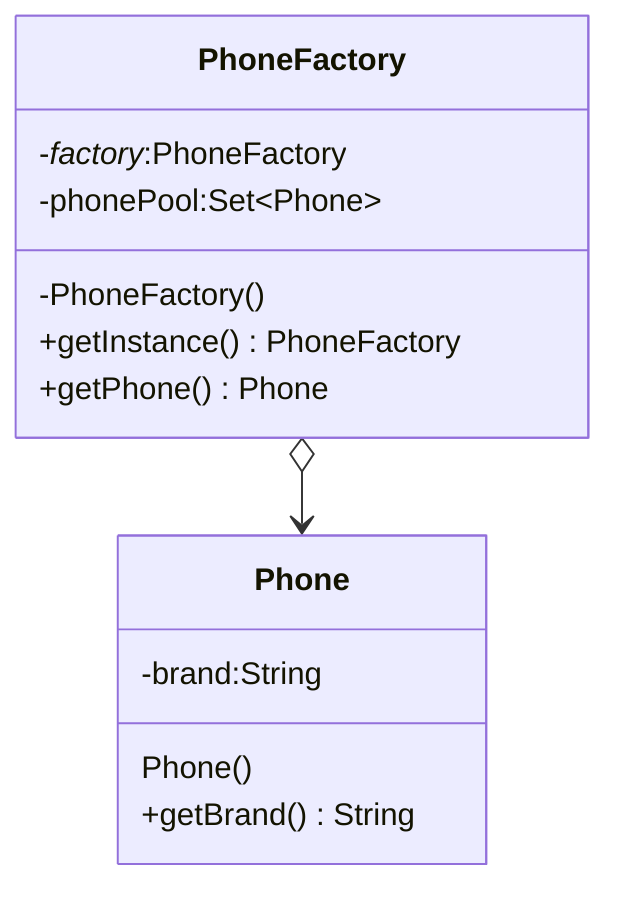

```mermaid
classDiagram

class Phone{
	-brand:String
	Phone()
	+getBrand()String
}

class PhoneFactory{
	-_factory_:PhoneFactory
	-phonePool:Set~Phone~
	-PhoneFactory()
	+getInstance()PhoneFactory
	+getPhone()Phone
}

PhoneFactory o--> Phone
```

