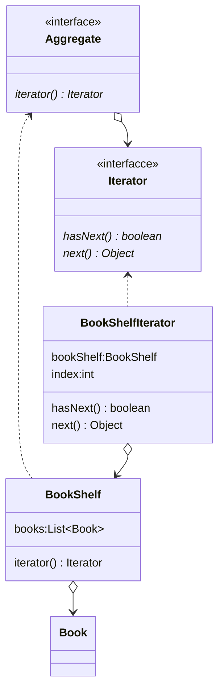

```mermaid
classDiagram

class Aggregate{
    <<interface>>
    iterator()*Iterator
}

class Iterator{
	<<interfacce>>
	hasNext()*boolean
	next()*Object
}

Aggregate o--> Iterator

class Book

class BookShelf{
	books:List~Book~
	iterator()Iterator
}

Aggregate <.. BookShelf
BookShelf o--> Book

class BookShelfIterator{
	bookShelf:BookShelf
	index:int
	hasNext()boolean
	next()Object
}

Iterator <.. BookShelfIterator

BookShelfIterator o--> BookShelf
```

