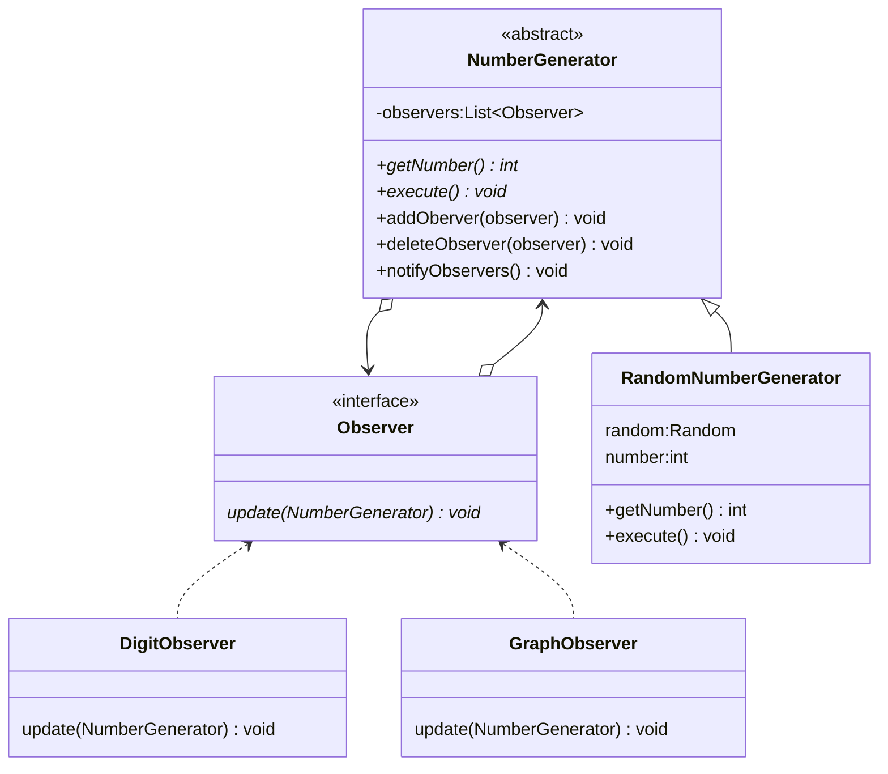

```mermaid
classDiagram

class NumberGenerator{
	<<abstract>>
	-observers:List~Observer~
	+getNumber()*int
	+execute()*void
	+addOberver(observer)void
	+deleteObserver(observer)void
	+notifyObservers()void
}

class Observer{
	<<interface>>
	update(NumberGenerator)*void
}

class RandomNumberGenerator{
	random:Random
	number:int
	+getNumber()int
	+execute()void
}

class DigitObserver{
	update(NumberGenerator)void
}

class GraphObserver{
	update(NumberGenerator)void
}

NumberGenerator <|-- RandomNumberGenerator
Observer <.. DigitObserver
Observer <.. GraphObserver
NumberGenerator o--> Observer
Observer o--> NumberGenerator
```

