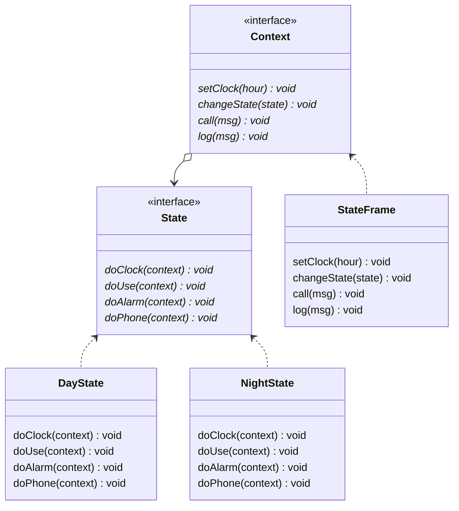

```mermaid
classDiagram

class State{
	<<interface>>
	doClock(context)*void
	doUse(context)*void
	doAlarm(context)*void
	doPhone(context)*void
}

class DayState{
	doClock(context)void
	doUse(context)void
	doAlarm(context)void
	doPhone(context)void
}

class NightState{
	doClock(context)void
	doUse(context)void
	doAlarm(context)void
	doPhone(context)void
}

State <.. DayState
State <.. NightState

class Context{
	<<interface>>
	setClock(hour)*void
	changeState(state)*void
	call(msg)*void
	log(msg)*void
}

class StateFrame{
	setClock(hour)void
	changeState(state)void
	call(msg)void
	log(msg)void
}

Context <.. StateFrame

Context o--> State
```

