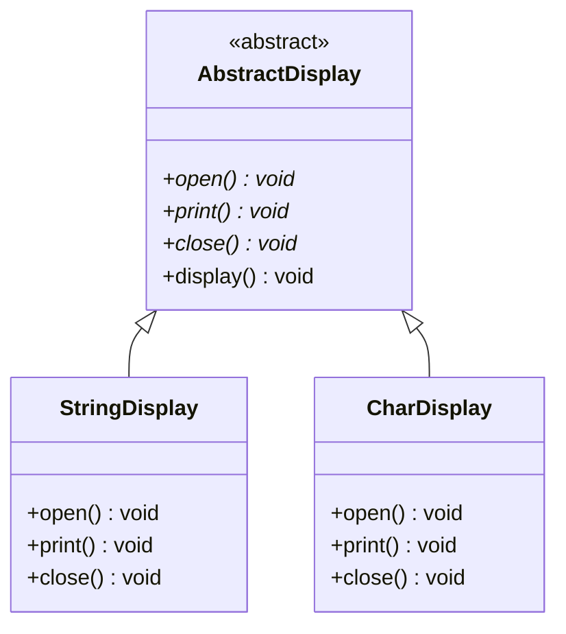

```mermaid
classDiagram

class AbstractDisplay{
	<<abstract>>
	+open()*void
	+print()*void
	+close()*void
	+display()void
}

class StringDisplay{
	+open()void
	+print()void
	+close()void
}

class CharDisplay{
	+open()void
	+print()void
	+close()void
}

AbstractDisplay <|-- StringDisplay
AbstractDisplay <|-- CharDisplay
```

