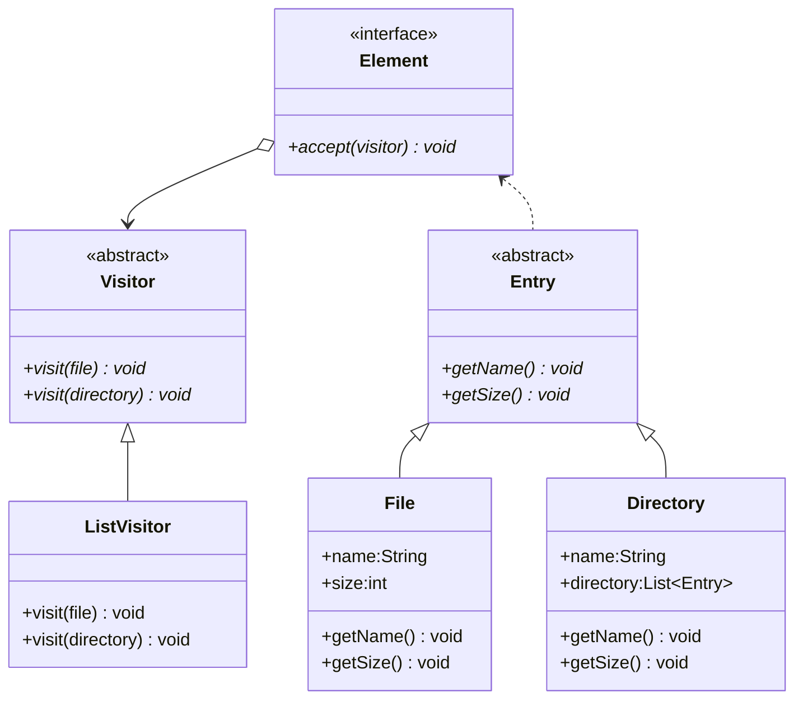

```mermaid
classDiagram

class Visitor{
	<<abstract>>
	+visit(file)*void
	+visit(directory)*void
}

class Element{
	<<interface>>
	+accept(visitor)*void
}

class ListVisitor{
	+visit(file)void
	+visit(directory)void
}

Visitor <|-- ListVisitor
Element o--> Visitor

class Entry{
	<<abstract>>
	+getName()*void
	+getSize()*void
}

Element <.. Entry

class File{
	+name:String
	+size:int
	+getName()void
	+getSize()void
}

class Directory{
	+name:String
	+directory:List~Entry~
	+getName()void
	+getSize()void
}

Entry <|-- File
Entry <|-- Directory
```

